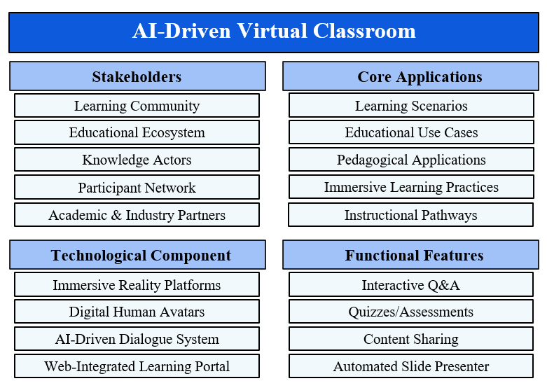
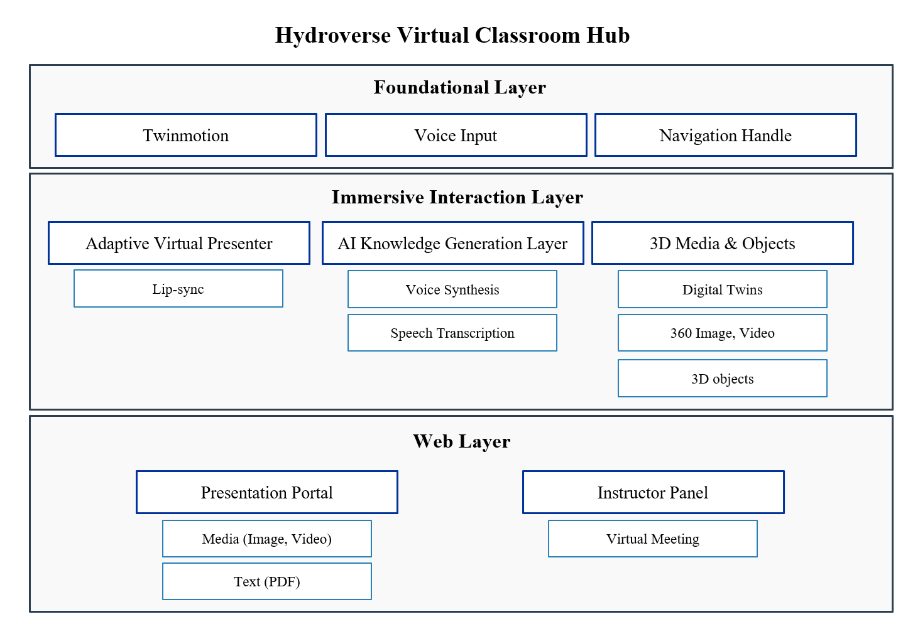
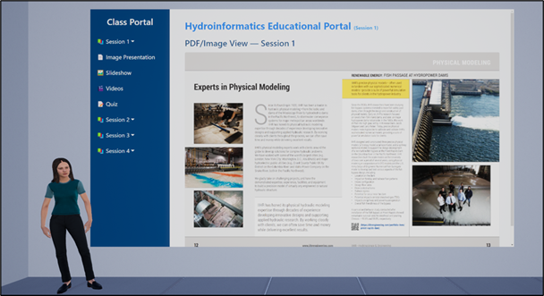
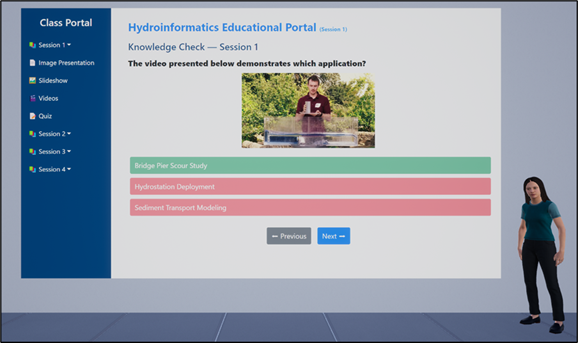
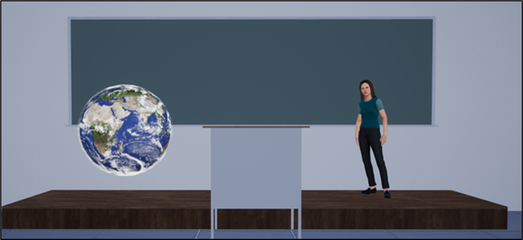
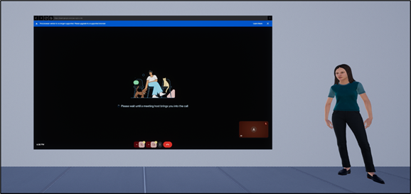

<p align="center">
  
</p>

# HydroVerse Education: AI-Assisted Immersive Learning Framework


**HydroVerse Education** is an immersive virtual classroom environment designed to modernize hydroinformatics education through the integration of Virtual Reality (VR) and Artificial Intelligence (AI). This system transforms traditional learning by enabling students to engage with dynamic content, interact with realistic Metahuman instructors, and explore complex water systems in a simulated 3D space.

The platform utilizes advanced technologies such as Unreal Engine, Metahuman, and Generative AI to create an interactive virtual classroom with immersive communication and knowledge generation features.

---

## Table of Contents
- [Key Features](#key-features)
- [System Architecture](#system-architecture)
- [Installation & Requirements](#installation--requirements)
- [Modules & Usage](#modules--usage)
- [Data Availability](#data-availability)
- [Funding & Acknowledgements](#funding--acknowledgements)
- [Citation](#citation)

---

## Key Features

* **AI-Driven Virtual Classroom:** An interactive 3D environment that replicates face-to-face learning dynamics with lecture boards, seating, and pedagogical tools.
* **Adaptive Virtual Presenter:** A Metahuman instructor that delivers voice-based lectures, moderates discussions, and answers questions in real-time.
* **Presentation Portal:** A web-integrated interface for viewing slides, videos, and taking interactive quizzes within the VR space.
* **Integrated Learning Hub:** Supports experiential learning through digital twins of hydraulic structures and 360° immersive media.
* **Instructor Collaboration Panel:** Enables real-time supervision and live video conferencing, allowing human instructors to join the virtual session directly.
* **Voice-Driven Interaction:** Utilizes natural language processing to convert user speech to text and synthesize AI responses with synchronized lip movements.

---

## System Architecture

The HydroVerse Education architecture is organized into three interconnected layers: the Foundational Layer, the Immersive Interaction Layer, and the Content Management Web Layer.

<p align="center">
  
  <br>
  <em>Figure: System Architecture of AI-Driven Virtual Classroom.</em>
</p>

### Core Components
* **Foundational Layer:** Utilizes **Twinmotion** for environment creation and handles **Voice Input** and navigation.
* **Immersive Interaction Layer:** Hosts the **Adaptive Virtual Presenter** (Metahuman), **AI Knowledge Layer** (OpenAI), and **3D Media** integration.
* **Content Management Web Layer:** A local web server hosts the **Presentation Portal** and **Instructor Panel**, bridging external resources with the VR experience.

---

## Installation & Requirements

### Hardware Requirements
* **VR Headset:** Meta Quest 3 (Recommended) via Link/AirLink.
* **PC Specifications:** High-performance PC (e.g., Intel Core i9, NVIDIA RTX 4080) recommended for real-time rendering.

### Software Prerequisites
* [Unreal Engine 5.3](https://www.unrealengine.com/)
* Python 3.x

### Setup Instructions

1.  **Clone the Repository:**
    ```bash
    git clone [https://github.com/uihilab/HydroVerse-Education.git](https://github.com/uihilab/HydroVerse-Education.git)
    ```

2.  **Install Required Plugins:**
    Copy the following plugins into the `Plugins` folder within the project directory:
    * **NV_ACE_Reference** (NVIDIA Audio2Face integration)
    * **OpenAI** (OpenAI API integration)

3.  **Configure Authentication:**
    Locate the configuration files in the root directory and update them with your API keys:
    
    * `OpenAIAuth.ini`:
        ```ini
        APIKey=YOUR_OPENAI_API_KEY
        OrganizationID=YOUR_ORG_ID
        ProjectID=YOUR_PROJECT_ID
        ```
    * `OnlineServicesAuth.ini`:
        ```ini
        WeatherstackAccessKey=YOUR_KEY
        NewsApiOrgApiKey=YOUR_KEY
        ```

4.  **Launch the User Interface Server:**
    Before running the VR application, you must start the local web server for the education portal. Open a terminal in the `UI_Education` directory and run:
    ```bash
    python -m http.server 8000
    ```

5.  **Run the Project:**
    * Open `HydroVerseEducation.uproject` in Unreal Engine 5.3.
    * Ensure the **OpenXR**, **NV_ACE_Reference**, and **OpenAI** plugins are enabled.
    * Build shaders and launch "VR Preview".

---

## Modules & Usage

### 1. Presentation Portal
Learners access structured course materials through the **Presentation Portal**. This includes interactive slideshows, video lectures with chapter navigation, and quizzes for knowledge assessment.

<p align="center">
  
  <br>
  <em>Figure: Presentation Portal in the Hydroinformatics Education Hub.</em>
</p>

### 2. Adaptive Virtual Presenter
The Metahuman instructor introduces sessions, explains concepts found in slides or videos, and answers student questions using the AI knowledge generation layer.

<p align="center">
  
  <br>
  <em>Figure: Virtual Instructor guiding a quiz section.</em>
</p>

### 3. Integrated Learning Hub (3D & 360°)
This module allows exploration of **Digital Twins** (e.g., hydraulic structures) and **360° Media**. Learners can manipulate objects while the Avatar provides context-aware explanations.

<p align="center">
  
  <br>
  <em>Figure: 3D models and digital twins for interactive learning.</em>
</p>

### 4. Instructor Collaboration Panel
Instructors can join the session via video conferencing to provide live supervision and mentorship. This panel seamlessly integrates real-time human interaction into the virtual classroom.

<p align="center">
  
  <br>
  <em>Figure: Instructor Panel enabling live supervision and video conferencing.</em>
</p>

---

## Data Availability

* **Source Code:** Available in this repository.
* **3D Assets & Content:** Course materials, metadata, and digital twins are managed via the web-based system in the `UI_Education` directory.
* **License:** This project is licensed under the MIT License - see the [LICENSE.txt](LICENSE.txt) file for details.

---

## Funding & Acknowledgements

This project was funded by the **National Oceanic and Atmospheric Administration (NOAA)** via a cooperative agreement with the University of Alabama (NA22NWS4320003) awarded to the Cooperative Institute for Research to Operations in Hydrology (CIROH).

---

## Citation

If you use this system in your research, please cite our paper:

Rahmani, A., Sermet, Y., & Demir, I. (2025). HydroVerse Education: An AI-Assisted Education Framework for Immersive Learning and Training Environments. EarthArXiv. https://doi.org/10.31223/X5FV02

**BibTeX:**

```bibtex
@article{rahmani2025hydroverseedu,
  title={HydroVerse Education: An AI-Assisted Education Framework for Immersive Learning and Training Environments},
  author={Rahmani, Ali and Sermet, Yusuf and Demir, Ibrahim},
  journal={EarthArXiv},
  year={2025},
  doi={10.31223/X5FV02},
  url={[https://eartharxiv.org/repository/view/11231/](https://eartharxiv.org/repository/view/11231/)}
}